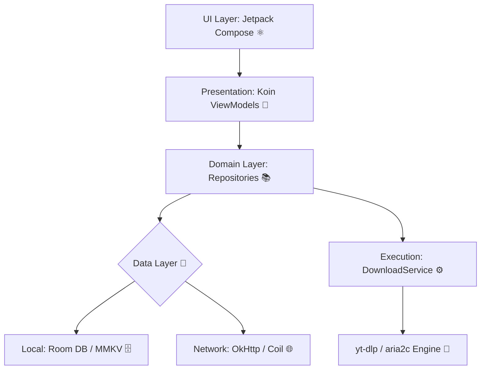

<div align="center">
  
  <h1>🚀 DartDL 🎯</h1>
  <p><strong>🌟 The Ultimate Open-Source Download Manager for Android 🌟</strong></p>
  
  [](https://kotlinlang.org)
  [](https://developer.android.com/jetpack/compose)
  [](https://m3.material.io)
  [](https://github.com/yt-dlp/yt-dlp)
</div>

<br>

---

## 🔮 The Vision: Why We Built DartDL 🛡️

In the modern mobile landscape, downloading media shouldn't be a fragmented, ad-ridden experience. **DartDL** was born out of the necessity for a powerful, aesthetically pleasing, and highly customizable media downloader that respects user privacy and leverages the immense power of `yt-dlp` directly on your Android device. 

We didn't just build a 📲 downloader; we built an **extensible media acquisition engine** 🚀.

---

## ✨ Core Features & Technical Highlights 💡

We've pushed the boundaries of Android development to create a seamless experience:

### 🎨 Material You & Dynamic Theming 🖌️
*   **100% Jetpack Compose Architecture:** ⚛️ The entire UI layer is built declaratively, ensuring buttery smooth animations and a reactive state.
*   **Monet Colors:** 🌈 DartDL fully embraces Android 12+ dynamic color extraction, meaning the app adapts its look to match your system wallpaper, providing a deeply personalized feel.
*   **Custom Color Engine:** ⚙️ We built a dedicated `:color` Gradle module to handle complex color processing and seamless dark/light mode transitions. 🌗

### ⚡ The Power of yt-dlp on Mobile 📱
*   **Embedded Python Environment:** 🐍 DartDL doesn't just call APIs; it embeds the complete `yt-dlp` python engine natively. 🛠️
*   **Aria2c Multi-Threading:** 🌪️ To turbocharge download speeds, we integrated the `aria2c` binary. This means files are downloaded in parallel chunks, saturating your network connection. 🏎️
*   **Template Engine:** 🛠️ Power users can craft custom `yt-dlp` commands. DartDL passes these securely to the execution layer. 🛡️

### 🧠 Intelligent Background Processing 🔄
*   **Foreground Services:** ⏳ Downloads survive app closures. We utilize persistent Android Foreground Services to keep the download engine alive even when you switch tasks. 🔒
*   **Koin Dependency Injection:** 💉 The app's architecture is deeply decoupled. Repositories, ViewModels, and Network clients are injected, making the codebase highly testable and scalable. 📈

### 🗄️ High-Performance Architecture 🏗️
*   **Room Database:** 🗃️ Built-in SQL persistence for maintaining download queues, historical records, and user preferences offline. 📁
*   **MMKV Storage:** ⚡ We ditched standard SharedPreferences for Tencent's MMKV, drastically reducing I/O latency for frequently accessed app settings. 🚀

---

## 🏗️ Inside the Codebase: Architecture Overview 🧩

The repository is structured for clean separation of concerns and rapid feature iteration:



### 📂 Deep Dive: Project Structure Tree

```text
📂 ./
┣ 📂 app/                        📱 Main Android application module
┃ ┣ 📜 build.gradle.kts          🔨 App-level build configuration
┃ ┗ 📂 src/
┃   ┣ 📂 main/
┃   ┃ ┣ 📜 AndroidManifest.xml   ⚙️ App properties & permissions
┃   ┃ ┣ 📂 java/com/dartdl/app/
┃   ┃ ┃ ┣ 📂 database/           🗄️ Room DB definitions and DAOs
┃   ┃ ┃ ┣ 📂 download/           ⬇️ Download service, tasks, yt-dlp executors
┃   ┃ ┃ ┣ 📂 ui/                 🎨 Jetpack Compose UI layout, pages, and components
┃   ┃ ┃ ┣ 📂 util/               🛠️ Helper functions and extensions
┃   ┃ ┃ ┗ 📂 viewmodel/          🧠 Koin-injected ViewModels for UI state
┃   ┃ ┗ 📂 res/                  🖼️ Android resources (icons, strings, themes)
┃   ┗ 📂 playStore/              🛡️ Flavor-specific code for Google Play release
┣ 📂 buildSrc/                   🧰 Custom Gradle build constants
┣ 📂 color/                      🖌️ Secondary module for color processing/dynamic theming
┣ 📂 gradle/                     📦 Gradle wrapper and version catalog (libs.versions.toml)
┣ 📂 fastlane/                   🏎️ Fastlane configuration for automated deployment
┗ 📂 .github/workflows/          🤖 GitHub Actions CI/CD pipelines
```

*Note: All log files (`.log`, `*log*.txt`) have been successfully removed to keep the repository clean. 🧹*

## 🚀 How to Build and Run 🛠️

1. **Clone the project** 📥: 
   Ensure you have cloned this repository and initialized all submodules (if any).
2. **Setup Environment** 💻: 
   - JDK 21+ is required. ☕
   - Android Studio minimum version Ladybug is recommended. 🐞
3. **Build Variants** 🏗️:
   - `genericDebug` / `genericRelease`: Standard build with all features enabled. 🔓
   - `playStoreDebug` / `playStoreRelease`: Version intended for Google Play, with certain youtube downloading features disabled to comply with policies. 🛡️
   - `githubPreviewDebug` / `githubPreviewRelease`: Pre-release builds containing experimental features. 🧪
4. **Compile** ⚙️:
   - You can build the app using Gradle: `./gradlew assembleGenericDebug` for testing.
   - The output APK will be placed in `app/build/outputs/apk/`. 📦

### Working with yt-dlp 🎬
The core of DartDL relies on `yt-dlp`. The library is extracted to the app's internal storage upon first launch. When debugging download issues, check `DownloadService.kt` and `DownloaderV2.kt` where `YoutubeDL.getInstance().execute()` commands are constructed. 🔍
