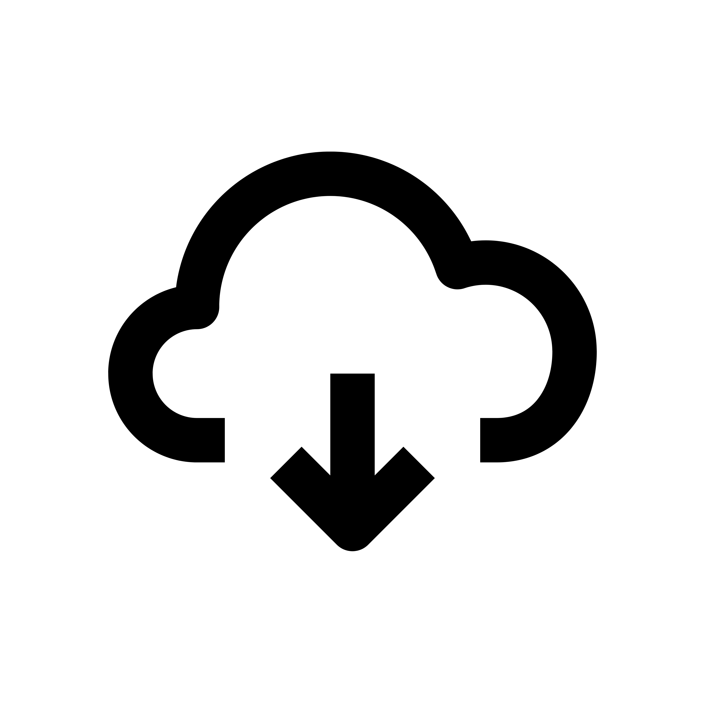

<div align="center">


# DartDL

<p>
    <b>A fast, modern video downloader app for Android, powered by yt-dlp.</b>
</p>

</div>

---

## 🚀 Overview

**DartDL** is a powerful video/audio downloading application designed with a clean, modern interface using Material You principles. It allows you to download videos from hundreds of supported platforms directly to your Android device with advanced format selection and metadata extraction.

> **Note on Play Store Compliance:** Due to Google Play strict policies, downloading from YouTube is explicitly **disabled** in the official Play Store release of DartDL to prevent account suspension.

## ✨ Features

- **Blazing Fast Downloads:** Powered by the robust `yt-dlp` backend.
- **Material You Design:** A beautiful, responsive UI that adapts to your device's theme colors.
- **Background Downloading:** Uses efficient Android services to download in the background without keeping the app open.
- **Subtitles & Metadata:** Automatically embeds thumbnails, metadata, and subtitles into downloaded files alongside the video.
- **Custom Formats:** Choose exactly the audio or video quality you want.
- **PlayList Support:** Download entire playlists with a single click.

## 📂 Project Structure 📱

```text
📂 ./
┣ 📂 app/                        📱 Main Android application module
┣ 📂 buildSrc/                   🧰 Custom Gradle build constants
┣ 📂 color/                      🖌️ Secondary module for color processing/dynamic theming
┣ 📂 gradle/                     📦 Gradle wrapper and version catalog
┣ 📂 fastlane/                   🏎️ Fastlane configuration for automated deployment
┗ 📂 logo_assets/                🎨 Branding and design assets
```

## 🛠️ Build Instructions

To build DartDL from source, you will need **JDK 21** and Android Studio.

### Standard Build (Everything Enabled)
```bash
./gradlew assembleGithubRelease
```

### Google Play Store Build (YouTube Disabled)
```bash
./gradlew bundlePlayStoreRelease
```
*This generates a compliant `.aab` file ready for Play Console upload.*

## ☕ Support

If you find DartDL useful and want to support its development, you can buy me a coffee!

<a href="https://www.buymeacoffee.com/Amanblaze" target="_blank"></a>

## 📧 Support & Feedback

For any issues or feedback, please contact us at: **support@amanblaze.in**

## 📜 License

Copyright © 2024-2026 **Amanblaze**. All rights reserved.

DartDL is a proprietary video downloader project. The DartDL Icon and Brand Name are custom assets and should not be reused without permission.
