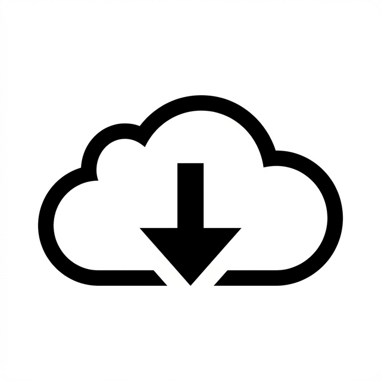

# DartDL

    <b>A fast, modern video downloader app for Android, powered by yt-dlp.</b>
     
    <a href="https://github.com/Amanblaze-in/DartDl">View the repository on GitHub</a>

---

## 🚀 Overview

**DartDL** is a powerful video/audio downloading application designed with a clean, modern interface using Material You principles. It allows you to download videos from hundreds of supported platforms directly to your Android device with advanced format selection and metadata extraction.

## 💾 Download Options

There are two versions of DartDL available depending on your needs:

### 1. Play Store Version
*   **Status:** Official Release
*   **Restriction:** Downloading from **YouTube is disabled** to comply with Google Play Store policies.
*   **Ideal for:** Users who want automatic updates and don't need YouTube downloading.

### 2. Full Version (GitHub)
*   **Status:** Unrestricted Release
*   **Features:** All platforms supported, including **YouTube**.
*   **Ideal for:** Users who want the full power of yt-dlp without any restrictions.
*   **Download:** [Latest APK from GitHub Releases](https://github.com/Amanblaze-in/DartDl/releases)

---

## ✨ Features

- **Blazing Fast Downloads:** Powered by the robust `yt-dlp` backend.
- **Material You Design:** A beautiful, responsive UI that adapts to your device's theme colors.
- **Background Downloading:** Uses efficient Android services to download in the background.
- **Subtitles & Metadata:** Automatically embeds thumbnails and metadata into downloaded files.
- **Custom Formats:** Choose exactly the quality you want.

## 📜 License

DartDL is a free software project (licensed under the GNU General Public License v3.0). It is modified from the original open-source project to comply with modern branding and store policies.

* `yt-dlp` is used as a backend dependency.
* The DartDL Icon and Brand Name are custom assets.
